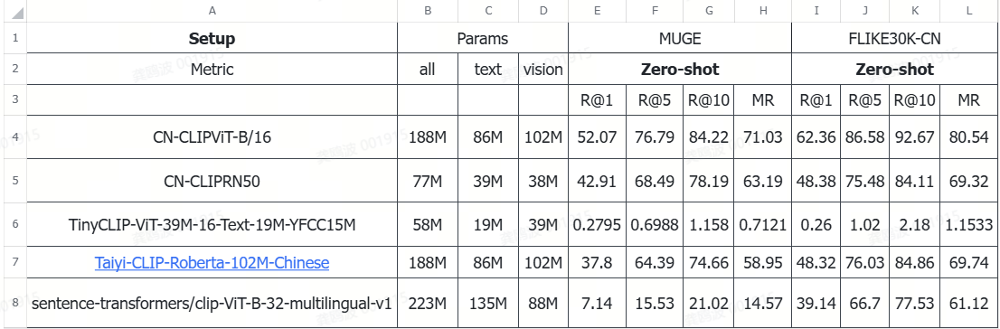

# 环境准备

```bash
# 或者从源代码安装
cd Chinese-CLIP
pip install -e .
```
## 预训练CKPT

将不同模型的权重下载在任意的位置，记住路径即可。可以使用以下方式从hugging face上下载相关模型：

```shell
model=wkcn/TinyCLIP-ViT-40M-32-Text-19M-LAION400M
model=wkcn/TinyCLIP-ViT-39M-16-Text-19M-YFCC15M
model=wkcn/TinyCLIP-ViT-8M-16-Text-3M-YFCC15M
model=wkcn/TinyCLIP-ViT-61M-32-Text-29M-LAION400M
model=IDEA-CCNL/Taiyi-CLIP-Roberta-102M-Chinese
model=M-CLIP/LABSE-Vit-L-14
model=M-CLIP/XLM-Roberta-Large-Vit-B-16Plus
model=sentence-transformers/clip-ViT-B-32-multilingual-v1


huggingface-cli download ${model} --resume-download --local-dir ${model}
```

或者使用以下方式从modelscope下载：

```shell
from modelscope import snapshot_download

models = [
"Qwen/Qwen3-30B-A3B-Instruct-2507"
]

for model in models:
    modeli_dir = snapshot_download(model, cache_dir=f"./")

```

## 数据集格式预处理

为了与Chinese-CLIP代码适配，同时保证数据处理和读取的效率，我们建议将训练&评测使用的图文数据集统一组织成如下的方式：

```
${DATAPATH}
└── datasets/
    └── ${dataset_name}/
        ├── train_imgs.tsv      # 图片id & 图片内容
        ├── train_texts.jsonl   # 文本id & 文本内容，连同匹配的图片id列表
        ├── valid_imgs.tsv
        ├── valid_texts.jsonl
        ├── test_imgs.tsv
        └── test_texts.jsonl
```
其中`${dataset_name}`代指数据集名称（如MUGE）

为保证文件处理效率，我们不是将图片以大量的小文件方式存放，而是将训练/验证/测试图片以base64形式分别存放在`${split}_imgs.tsv`文件中。文件每行表示一张图片，包含图片id（int型）与图片base64，以tab隔开，格式如下：
```
1000002	/9j/4AAQSkZJ...YQj7314oA//2Q==
```

将图片原始文件转换为base64的方式非常简单，请执行以下python代码：
```python
from PIL import Image
from io import BytesIO
import base64

img = Image.open(file_name) # 访问图片路径
img_buffer = BytesIO()
img.save(img_buffer, format=img.format)
byte_data = img_buffer.getvalue()
base64_str = base64.b64encode(byte_data) # bytes
base64_str = base64_str.decode("utf-8") # str
```

文本信息及图文对匹配关系则保存在`${split}_texts.jsonl`文件。文件每行是一行json，格式如下：
```
{"text_id": 8428, "text": "高级感托特包斜挎", "image_ids": [1076345, 517602]}
```
对于测试集只有文本，不知道图文对匹配关系的情况，每行的`image_ids`字段处理为空列表即可，即`"image_ids": []`。

最后，我们还需要将tsv和jsonl文件一起序列化，转换为内存索引的LMDB数据库文件，方便训练时的随机读取
```
python cn_clip/preprocess/build_lmdb_dataset.py \
    --data_dir ${DATAPATH}/datasets/${dataset_name}
    --splits train,valid,test
```
例如对于MUGE数据集，则`${dataset_name}`设为MUGE，`--splits`指定需要转换的数据集划分，以逗号不加空格分隔。转换后，数据集文件夹下会对应增加以下LMDB序列化文件
```
${DATAPATH}
└── datasets/
    └── ${dataset_name}/
        └── lmdb/
            ├── train
            │   ├── imgs
            │   └── pairs
            ├── valid
            └── test
```

为了降低上手难度，我们也提供了按上述步骤预处理好的MUGE数据（[下载链接](https://clip-cn-beijing.oss-cn-beijing.aliyuncs.com/datasets/MUGE.zip)）和Flickr30K-CN数据（[下载链接](https://clip-cn-beijing.oss-cn-beijing.aliyuncs.com/datasets/Flickr30k-CN.zip)）压缩包，直接下载解压并放置于`${DATAPATH}/datasets/`目录下即可。如果需要[COCO-CN](https://github.com/li-xirong/coco-cn)数据，请向原作者进行申请许可完成后，邮件联系我们吧。

**直接下载链接处理好的数据到datasets文件夹下并进行解压即可。**

# 测试图文检索的效果

这里以Chinese-CLIP为例，脚本是`cal_metric.sh`

```shell
#
export CUDA_VISIBLE_DEVICES=0
export PYTHONPATH=${PYTHONPATH}:`pwd`/cn_clip

split=valid # 指定计算valid或test集特征
#dataset_name=Flickr30k-CN
dataset_name=MUGE
#resume=../clip_cn_vit-b-16.pt
resume=../clip_cn_rn50.pt

python3 -u cn_clip/eval/extract_features.py \
    --extract-image-feats \
    --extract-text-feats \
    --image-data="./datasets/${dataset_name}/lmdb/${split}/imgs" \
    --text-data="./datasets/${dataset_name}/${split}_texts.jsonl" \
    --img-batch-size=32 \
    --text-batch-size=32 \
    --context-length=52 \
    --resume=${resume} \
    --vision-model=RN50 \
    --text-model=RBT3-chinese

python3 -u cn_clip/eval/make_topk_predictions.py \
    --image-feats="./datasets/${dataset_name}/${split}_imgs.img_feat.jsonl" \
    --text-feats="./datasets/${dataset_name}/${split}_texts.txt_feat.jsonl" \
    --top-k=10 \
    --eval-batch-size=32768 \
    --output="./datasets/${dataset_name}/${split}_predictions.jsonl"

python3 cn_clip/eval/evaluation.py \
    ./datasets/${dataset_name}/${split}_texts.jsonl \
    ./datasets/${dataset_name}/${split}_predictions.jsonl \
    output.json
cat output.json

```

对于MUGE数据集，使用valid。对于Flickr30k-CN数据集，使用test。

同时为了能够对任意的图文检索数据集进行评测，可以在cn_clip/eval下新建一个python文件，里面数据加载的地方不需要改，只需要加载好模型并且定义好如何提取文本特征和图片特征即可，这里以transformers的CLIPModel为例：

```python
# -*- coding: utf-8 -*-
'''
This script extracts image and text features for evaluation. (with single-GPU)
'''
import base64
import os
import argparse
import logging
from io import BytesIO
from pathlib import Path
import json
from PIL import Image

import lmdb
import torch
from torch.utils.data import Dataset, DataLoader, SequentialSampler
from tqdm import tqdm

from cn_clip.clip.model import convert_weights, CLIP
from cn_clip.training.main import convert_models_to_fp32

def parse_args():
    parser = argparse.ArgumentParser()
    parser.add_argument(
        '--extract-image-feats', 
        action="store_true", 
        default=False, 
        help="Whether to extract image features."
    )
    parser.add_argument(
        '--extract-text-feats', 
        action="store_true", 
        default=False, 
        help="Whether to extract text features."
    )
    parser.add_argument(
        '--image-data', 
        type=str, 
        default="../Multimodal_Retrieval/lmdb/test/imgs", 
        help="If --extract-image-feats is True, specify the path of the LMDB directory storing input image base64 strings."
    )
    parser.add_argument(
        '--text-data', 
        type=str, 
        default="../Multimodal_Retrieval/test_texts.jsonl", 
        help="If --extract-text-feats is True, specify the path of input text Jsonl file."
    )
    parser.add_argument(
        '--image-feat-output-path', 
        type=str, 
        default=None, 
        help="If --extract-image-feats is True, specify the path of output image features."
    )    
    parser.add_argument(
        '--text-feat-output-path', 
        type=str, 
        default=None, 
        help="If --extract-image-feats is True, specify the path of output text features."
    )
    parser.add_argument(
        "--img-batch-size", type=int, default=64, help="Image batch size."
    )
    parser.add_argument(
        "--text-batch-size", type=int, default=64, help="Text batch size."
    )
    parser.add_argument(
        "--context-length", type=int, default=52, help="The maximum length of input text (include [CLS] & [SEP] tokens)."
    )
    parser.add_argument(
        "--resume",
        default=None,
        type=str,
        help="path to latest checkpoint (default: none)",
    )
    parser.add_argument(
        "--precision",
        choices=["amp", "fp16", "fp32"],
        default="amp",
        help="Floating point precision."
    )
    parser.add_argument(
        "--model-path",
        default="ViT-B-16",
        help="Name of the vision backbone to use.",
    )
    parser.add_argument(
        "--debug",
        default=False,
        action="store_true",
        help="If true, more information is logged."
    )    
    args = parser.parse_args()

    return args    


if __name__ == "__main__":
    args = parse_args()

    assert args.extract_image_feats or args.extract_text_feats, "--extract-image-feats and --extract-text-feats cannot both be False!"

    # Log params.
    print("Params:")
    for name in sorted(vars(args)):
        val = getattr(args, name)
        print(f"  {name}: {val}")
    
    args.gpu = 0
    torch.cuda.set_device(args.gpu)

    from transformers import CLIPProcessor, CLIPModel

    # 加载 TinyCLIP 模型
    model = CLIPModel.from_pretrained(args.model_path).to(f"cuda:{args.gpu}")
    model.eval()
    processor = CLIPProcessor.from_pretrained(args.model_path)


    class EvalTxtDataset(Dataset):
        def __init__(self, jsonl_filename):
            self.texts = []
            with open(jsonl_filename, "r", encoding="utf-8") as fin:
                for line in fin:
                    obj = json.loads(line.strip())
                    self.texts.append((obj['text_id'], obj['text']))

        def __len__(self):
            return len(self.texts)

        def __getitem__(self, idx):
            return self.texts[idx]  # 返回 (id, raw_text)


    class EvalImgDataset(Dataset):
        def __init__(self, lmdb_imgs):
            self.env_imgs = lmdb.open(lmdb_imgs, readonly=True, create=False, lock=False)
            with self.env_imgs.begin() as txn:
                cursor = txn.cursor()
                self.keys = [k for k, _ in cursor if k != b'num_images']
            self.number_images = len(self.keys)

        def __len__(self):
            return self.number_images

        def __getitem__(self, idx):
            with self.env_imgs.begin() as txn:
                image_b64 = txn.get(self.keys[idx])
                image = Image.open(BytesIO(base64.urlsafe_b64decode(image_b64))).convert("RGB")
            return int(self.keys[idx].decode("utf8")), image

    # See https://discuss.pytorch.org/t/valueerror-attemting-to-unscale-fp16-gradients/81372
    if args.precision == "amp" or args.precision == "fp32":
        convert_models_to_fp32(model)
    model.cuda(args.gpu)
    if args.precision == "fp16":
        convert_weights(model)

    # ====== 2. 构造 DataLoader ======
    txt_dataset = EvalTxtDataset(args.text_data)
    img_dataset = EvalImgDataset(args.image_data)


    def collate_fn_img(batch):
        ids, images = zip(*batch)  # list of ids, list of PIL.Image
        return list(ids), list(images)

    txt_loader = DataLoader(txt_dataset, batch_size=args.text_batch_size, sampler=SequentialSampler(txt_dataset), num_workers=8)
    img_loader = DataLoader(img_dataset, batch_size=args.img_batch_size, sampler=SequentialSampler(img_dataset), num_workers=8,
                            collate_fn=collate_fn_img)

    # Get data.
    if args.extract_image_feats:
        print("Preparing image inference dataset.")
        print(txt_dataset[0])
    if args.extract_text_feats:
        print("Preparing text inference dataset.")
        print(img_dataset[0])
    
    # Make inference for texts
    if args.extract_text_feats:
        print('Make inference for texts...')
        if args.text_feat_output_path is None:
            args.text_feat_output_path = "{}.txt_feat.jsonl".format(args.text_data[:-6])
        write_cnt = 0
        with open(args.text_feat_output_path, "w") as fout:
            model.eval()
            with torch.no_grad():
                for batch in tqdm(txt_loader):
                    text_ids, texts = batch
                    text_inputs = processor(text=list(texts), return_tensors="pt", padding=True, truncation=True,max_length=args.context_length)
                    for k,v in text_inputs.items():
                        text_inputs[k] = v.to(f"cuda:{args.gpu}")
                    text_features = model.get_text_features(**text_inputs)
                    text_features /= text_features.norm(dim=-1, keepdim=True)
                    for text_id, text_feature in zip(text_ids.tolist(), text_features.tolist()):
                        fout.write("{}\n".format(json.dumps({"text_id": text_id, "feature": text_feature})))
                        write_cnt += 1
        print('{} text features are stored in {}'.format(write_cnt, args.text_feat_output_path))

    # Make inference for images
    if args.extract_image_feats:
        print('Make inference for images...')
        if args.image_feat_output_path is None:
            # by default, we store the image features under the same directory with the text features
            args.image_feat_output_path = "{}.img_feat.jsonl".format(args.text_data.replace("_texts.jsonl", "_imgs"))
        write_cnt = 0
        with open(args.image_feat_output_path, "w") as fout:
            model.eval()
            with torch.no_grad():
                for batch in tqdm(img_loader):
                    image_ids, images = batch
                    image_inputs = processor(images=list(images), return_tensors="pt").to(f"cuda:{args.gpu}")
                    image_features = model.get_image_features(**image_inputs)
                    image_features /= image_features.norm(dim=-1, keepdim=True)
                    for image_id, image_feature in zip(image_ids, image_features.tolist()):
                        fout.write("{}\n".format(json.dumps({"image_id": image_id, "feature": image_feature})))
                        write_cnt += 1
        print('{} image features are stored in {}'.format(write_cnt, args.image_feat_output_path))

    print("Done!")
```

# 测试结果

这里关注的是边缘设备下的图文检索模型：


